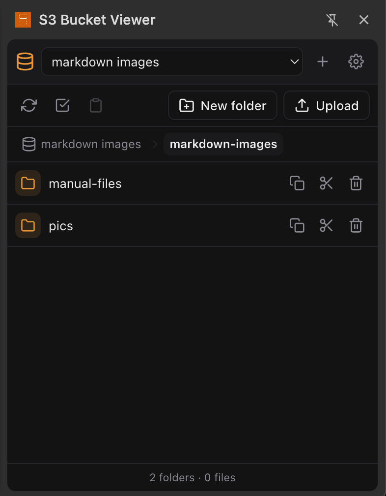
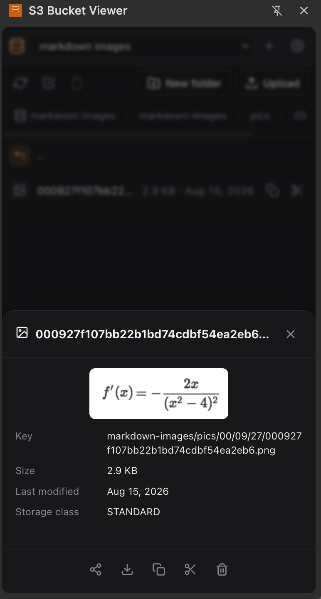

# Cloud Bucket Viewer

A Chrome side panel for browsing cloud storage like a file explorer — S3,
S3-compatible, Azure Blob Storage, Google Cloud Storage.

Add one or more connections — pick a type, then just a bucket/container name
and a key pair (everything else is optional or auto-detected) — stored only
in your browser, exportable/importable as JSON. Pick a connection and land
straight in that bucket, then browse folders, preview or edit files, and
copy, move or delete objects — all from a side panel that stays open next to
whatever tab you're on. No OAuth sign-in for any provider — every type
authenticates with a static key pair, the same shape as an S3 access key.

No build step, no cloud SDKs — plain JS signing requests directly (SigV4 for
S3/S3-compatible/GCS, Shared Key for Azure). See
[docs/design.md](docs/design.md) and
[docs/implementation.md](docs/implementation.md) for how it's built.

## Features

- Multiple named connections, each scoped to one bucket/container,
  switchable from the toolbar. Adding one only strictly needs a
  bucket/container name and a key pair — region (where applicable) is
  auto-detected, name defaults to the bucket name, and a starting key
  prefix is optional.
- Four connection types: **Amazon S3**, **S3-compatible** (Cloudflare R2,
  MinIO, etc — custom endpoint), **Azure Blob Storage** (storage account +
  Shared Key), **Google Cloud Storage** (HMAC key pair).
- Save validates the connection against the provider before storing it,
  with progress shown inline (region detection, then a real access check).
- Keys stored locally (`chrome.storage.local`) only; export/import as JSON.
- Browse folders → files with breadcrumb navigation and pagination.
- Preview images, video, audio and PDF inline; edit text/code/Markdown files
  directly (Markdown gets a rendered-preview toggle) and save back.
- Copy/cut/paste files and folders — clipboard-style, with a status
  indicator for what's queued — plus multi-select for bulk copy/cut/delete.
- Share a file as a provider URI (`s3://`, `az://`), an unsigned HTTP link,
  or a signed link with a configurable expiry.
- Download files. Create folders, recursive-delete folders.
- Upload a file (or drag-and-drop one) into the current folder.

## Install

1. `make zip` (or just point Chrome at `extension/` directly, see below).
2. Open `chrome://extensions`, enable **Developer mode**.
3. **Load unpacked** → select the `extension/` folder (no zip needed for
   local dev), or drag `dist/cloud-bucket-viewer.zip` onto the page.
4. Click the toolbar icon to open the side panel, then **+** to add a
   connection.

## Development

```sh
make lint   # syntax-check every .js file + manifest.json
make zip    # build dist/cloud-bucket-viewer.zip
make icons  # regenerate extension/icons/*.png
make clean  # remove dist/
```

No dependencies to install — everything runs on the system's `node`,
`python3` and `zip`.

`docs/store/` — Chrome Web Store listing assets: screenshots (1280x800)
and small promo tile (440x280).

## Security note

Access keys and secret keys are stored in plaintext in
`chrome.storage.local` (never synced) and are sent only to the endpoint the
connection names. Exporting connections writes those secrets to a plaintext
JSON file — handle exported files like any other credential file. A
"signed link" generated from Share is a presigned/SAS URL: anyone with it
can read that object until it expires, with no further authentication.

## Screenshots

**File browser**



**Object preview**


